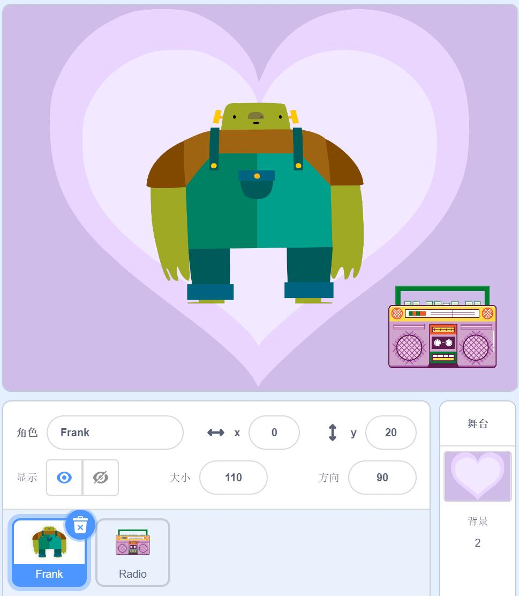
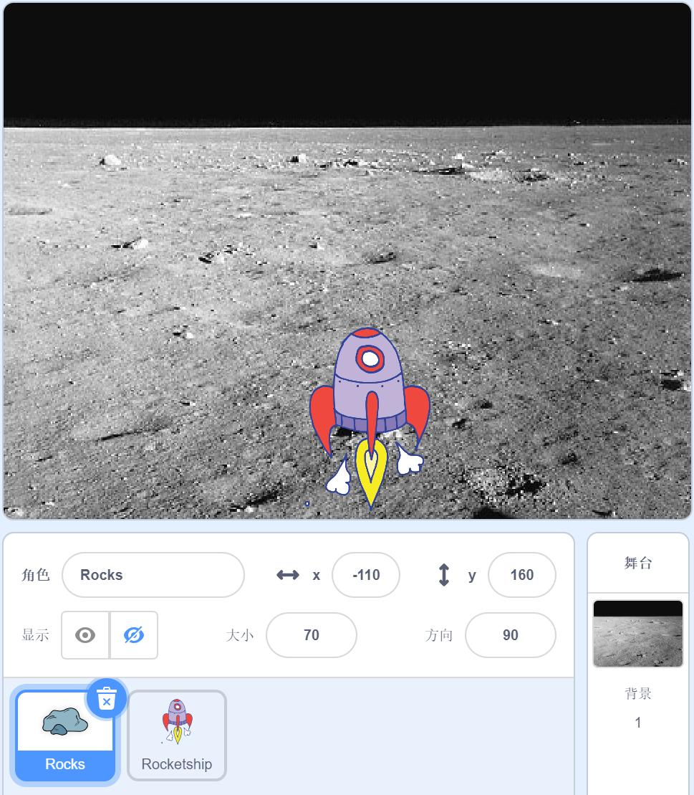

# CCF GESP 2025年3月认证 图形化编程 1级试题

## 题目1 - 闪亮登场

**准备工作：**

（1）删除默认小猫角色。

（2）添加角色 Radio 并为其添加声音 Cymbal Echo。

（3）添加角色 Frank。

（4）删除默认白色背景，添加背景 Neon Tunnel、Hearts。

**功能实现（根据注意事项，用积木块实现下列描述的功能）：**

（1）点击绿旗，舞台背景换成 Neon Tunnel。

（2）点击绿旗，角色 Radio 的初始位置为（X=170，Y=-120），初始方向为 90°，初始造型为 Radio-b，初始大小为 100。

（3）角色 Radio 完整地播放了两次音乐 Cymbal Echo，之后换成 Radio-a 造型。

（4）点击绿旗，角色 Frank 的初始位置为（X=0，Y=20），初始方向为 90°，初始大小为 10，初始造型为 frank-a。

（5）每隔 0.1 秒，角色 Frank 的大小增加 5，更换到下一个造型，重复执行 20 次。

（6）之后，背景更换为 Hearts，角色 Frank 说“大家好！”，2 秒。

**注意事项：**

- 功能（1）全部写在背景代码区的【当绿旗被点击】积木下面。

- 功能（2）（3）全部写在角色 Radio 代码区的【当绿旗被点击】积木下面。

- 功能（4）（5）（6）全部写在角色 Frank 代码区的【当绿旗被点击】积木下面。

## 题目2 - 躲避陨石

**准备工作：**

（1）删除默认小猫角色。

（2）添加角色 Rocks 和 Rocketship。

（3）删除默认白色背景，添加背景 Moon。

**功能实现（根据注意事项，用积木块实现下列描述的功能）：**

（1）点击绿旗，背景换成 Moon。

（2）点击绿旗，角色 Rocks 的初始位置为（X=-180 到 180 之间的随机数，Y=160），初始方向为 90°,初始大小为 70，初始状态为隐藏。

（3）等待按下空格键，按下空格键后，Rocks 的状态变为显示。之后从舞台上方以每次 y 坐标减少 10 的速度下降。

（4）若 Rocks 碰到舞台边缘，则说“没击中”，2 秒，隐藏起来结束自身脚本；若 Rocks 碰到 Rocketship，则说“击中”2 秒，结束自身脚本。

（5）点击绿旗，角色 Rocketship 的初始位置（X=14，Y=-110），初始方向 90°，初始大小 70。

（6）当按下向左键时，Rocketship 向左移动 10，当按下向右键时，Rocketship 向右移动 10（向左 x 坐标减少、向右 x 坐标增加）直到按下空格键为止。

**注意事项：**

- 功能（1）全部写在背景代码区的【当绿旗被点击】积木下面。

- 功能（2）（3）（4）全部写在角色 Rocks 代码区的【当绿旗被点击】积木下面。

- 功能（5）（6）写在角色 Rocketship 代码区的【当绿旗被点击】积木下面。
